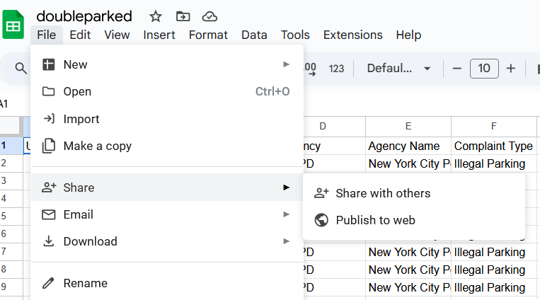
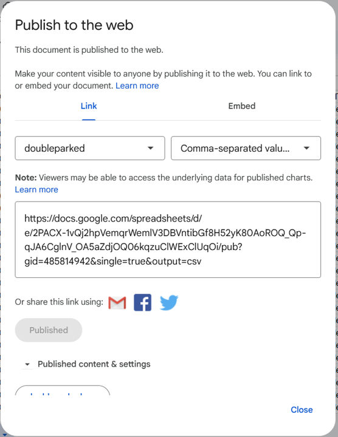
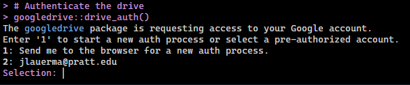

```{r setup, include=FALSE}
knitr::opts_chunk$set(echo = TRUE)
```

## Overview

There are several ways to access data from Google Drive in an R environment. This script explains the options; to replicate, you can copy/paste the code blocks into your R script. In the example that follows, I'll use a sample of data from the [311 Service Requests](https://data.cityofnewyork.us/Social-Services/311-Service-Requests-from-2010-to-Present/erm2-nwe9/about_data) dataset on *NYC Open Data*. I downloaded a sample of complaints about double parked cars in Brooklyn during one month in the summer of 2025, and then saved the CSV in my Google Drive.

### Option 1: Use the Google Sheets API

The first option is to publish your data via the Google Sheets API, and then use base R functions like `read_csv()` to read the data from the API URL. To do this, first open the Google Sheet, then navigate to `File -> Share -> Publish to web`.

{width="50%"}

Choose the option to publish as a CSV. Then copy the API url that the menu provides.

{width="35%"}

Use the url to run the following code with base R functions:

```{r}
# Store the URL as a variable
url <- "https://docs.google.com/spreadsheets/d/e/2PACX-1vQj2hpVemqrWemlV3DBVntibGf8H52yK80AoROQ_Qp-qJA6CglnV_OA5aZdjOQ06kqzuClWExClUqOi/pub?gid=485814942&single=true&output=csv"

# read the variable as a CSV
data <- read.csv(url)
head(data, n = 2)
```

Or alternatively, you can call the API directly as a parameter in `read.csv`

```{r}
data <- read.csv("https://docs.google.com/spreadsheets/d/e/2PACX-1vQj2hpVemqrWemlV3DBVntibGf8H52yK80AoROQ_Qp-qJA6CglnV_OA5aZdjOQ06kqzuClWExClUqOi/pub?gid=485814942&single=true&output=csv")
head(data, n = 2)
```

## Option 2: Use the `googledrive` library

While the Sheets API works fine for smaller data sets, larger tables will require more specialized tools. One option is to use the `googledrive` library to sign in directly to your drive account and load from there.

```{r}
# install and load the library
if (!require(googledrive)) install.packages("googledrive")
library("googlesheets4")
```

```{r}
# Authenticate the drive 
googledrive::drive_auth()
```

Choose either authentication option. Either way the tool will then open a web browser where you can enter your Google credentials. When fully connected, you should receive an `Authentication complete.` message in your terminal.

{width="75%"}

From there, find the general or sharing URL for the file, and use `read_sheet()` to integrate the data.

{width="75%"}

```{r}
## then use the read_sheet() function to load the url
data <- read_sheet("https://docs.google.com/spreadsheets/d/1J1dKJAg119ER0XHjd0BWDdJAH553s5Q_ud2m56KKeIg/edit?gid=485814942#gid=485814942")
head(data)
```

## Further reading

Bounthavong, Mark (2024) *R-Loading Data From Google Drive.* <https://rpubs.com/mbounthavong/R_load_data_from_Google_drive_p1>

`googledrive` technical documentation , <https://googledrive.tidyverse.org/>
