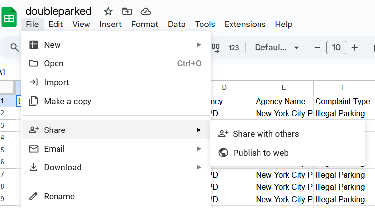
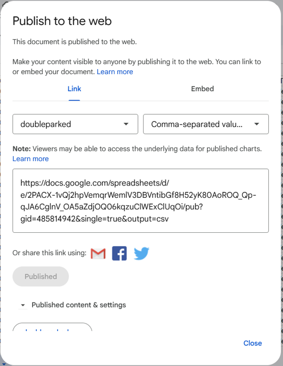
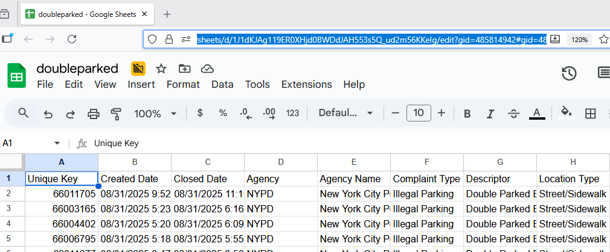

How to load data from Google Drive in R
================
John Lauermann
2025-09-17

## Overview

There are several ways to access data from Google Drive in an R
environment. This script explains the options; to replicate, you can
copy/paste the code blocks into your R script. In the example that
follows, I’ll use a sample of data from the [311 Service
Requests](https://data.cityofnewyork.us/Social-Services/311-Service-Requests-from-2010-to-Present/erm2-nwe9/about_data)
dataset on *NYC Open Data*. I downloaded a sample of complaints about
double parked cars in Brooklyn during one month in the summer of 2025,
and then saved the CSV in my Google Drive.

### Option 1: Use the Google Sheets API

The first option is to publish your data via the Google Sheets API, and
then use base R functions like `read_csv()` to read the data from the
API URL. To do this, first open the Google Sheet, then navigate to
`File -> Share -> Publish to web`.



Choose the option to publish as a CSV. Then copy the API url that the
menu provides.



Use the url to run the following code with base R functions:

``` r
# Store the URL as a variable
url <- "https://docs.google.com/spreadsheets/d/e/2PACX-1vQj2hpVemqrWemlV3DBVntibGf8H52yK80AoROQ_Qp-qJA6CglnV_OA5aZdjOQ06kqzuClWExClUqOi/pub?gid=485814942&single=true&output=csv"

# read the variable as a CSV
data <- read.csv(url)
head(data, n = 2)
```

    ##   Unique.Key          Created.Date            Closed.Date Agency
    ## 1   66011705 08/31/2025 9:52:07 AM 08/31/2025 11:11:40 AM   NYPD
    ## 2   66003165 08/31/2025 5:23:21 AM  08/31/2025 6:16:47 AM   NYPD
    ##                       Agency.Name  Complaint.Type
    ## 1 New York City Police Department Illegal Parking
    ## 2 New York City Police Department Illegal Parking
    ##                       Descriptor   Location.Type Incident.Zip
    ## 1 Double Parked Blocking Vehicle Street/Sidewalk        11239
    ## 2 Double Parked Blocking Vehicle Street/Sidewalk        11239
    ##           Incident.Address         Street.Name   Cross.Street.1
    ## 1 1530 PENNSYLVANIA AVENUE PENNSYLVANIA AVENUE     HORNELL LOOP
    ## 2      45 TWIN PINES DRIVE    TWIN PINES DRIVE LOUISIANA AVENUE
    ##        Cross.Street.2 Intersection.Street.1 Intersection.Street.2 Address.Type
    ## 1      SEAVIEW AVENUE          HORNELL LOOP        SEAVIEW AVENUE      ADDRESS
    ## 2 PENNSYLVANIA AVENUE      LOUISIANA AVENUE   PENNSYLVANIA AVENUE      ADDRESS
    ##       City            Landmark Facility.Type Status Due.Date
    ## 1 BROOKLYN PENNSYLVANIA AVENUE            NA Closed       NA
    ## 2 BROOKLYN    TWIN PINES DRIVE            NA Closed       NA
    ##                                                                                                                    Resolution.Description
    ## 1 The Police Department responded to the complaint and with the information available observed no evidence of the violation at that time.
    ## 2                                                  The Police Department responded to the complaint and took action to fix the condition.
    ##   Resolution.Action.Updated.Date Community.Board        BBL  Borough
    ## 1         08/31/2025 11:11:45 AM     05 BROOKLYN 3044520020 BROOKLYN
    ## 2          08/31/2025 6:16:52 AM     05 BROOKLYN 3044520001 BROOKLYN
    ##   X.Coordinate..State.Plane. Y.Coordinate..State.Plane. Open.Data.Channel.Type
    ## 1                    1018132                     174064                 ONLINE
    ## 2                    1016436                     175170                  PHONE
    ##   Park.Facility.Name Park.Borough Vehicle.Type Taxi.Company.Borough
    ## 1        Unspecified     BROOKLYN          SUV                   NA
    ## 2        Unspecified     BROOKLYN        Truck                   NA
    ##   Taxi.Pick.Up.Location Bridge.Highway.Name Bridge.Highway.Direction Road.Ramp
    ## 1                    NA                  NA                       NA        NA
    ## 2                    NA                  NA                       NA        NA
    ##   Bridge.Highway.Segment Latitude Longitude
    ## 1                     NA 40.64438 -73.87791
    ## 2                     NA 40.64742 -73.88401
    ##                                  Location
    ## 1 (40.64437729431419, -73.87790801772604)
    ## 2 (40.64741934884092, -73.88401417905266)

Or alternatively, you can call the API directly as a parameter in
`read.csv`

``` r
data <- read.csv("https://docs.google.com/spreadsheets/d/e/2PACX-1vQj2hpVemqrWemlV3DBVntibGf8H52yK80AoROQ_Qp-qJA6CglnV_OA5aZdjOQ06kqzuClWExClUqOi/pub?gid=485814942&single=true&output=csv")
head(data, n = 2)
```

    ##   Unique.Key          Created.Date            Closed.Date Agency
    ## 1   66011705 08/31/2025 9:52:07 AM 08/31/2025 11:11:40 AM   NYPD
    ## 2   66003165 08/31/2025 5:23:21 AM  08/31/2025 6:16:47 AM   NYPD
    ##                       Agency.Name  Complaint.Type
    ## 1 New York City Police Department Illegal Parking
    ## 2 New York City Police Department Illegal Parking
    ##                       Descriptor   Location.Type Incident.Zip
    ## 1 Double Parked Blocking Vehicle Street/Sidewalk        11239
    ## 2 Double Parked Blocking Vehicle Street/Sidewalk        11239
    ##           Incident.Address         Street.Name   Cross.Street.1
    ## 1 1530 PENNSYLVANIA AVENUE PENNSYLVANIA AVENUE     HORNELL LOOP
    ## 2      45 TWIN PINES DRIVE    TWIN PINES DRIVE LOUISIANA AVENUE
    ##        Cross.Street.2 Intersection.Street.1 Intersection.Street.2 Address.Type
    ## 1      SEAVIEW AVENUE          HORNELL LOOP        SEAVIEW AVENUE      ADDRESS
    ## 2 PENNSYLVANIA AVENUE      LOUISIANA AVENUE   PENNSYLVANIA AVENUE      ADDRESS
    ##       City            Landmark Facility.Type Status Due.Date
    ## 1 BROOKLYN PENNSYLVANIA AVENUE            NA Closed       NA
    ## 2 BROOKLYN    TWIN PINES DRIVE            NA Closed       NA
    ##                                                                                                                    Resolution.Description
    ## 1 The Police Department responded to the complaint and with the information available observed no evidence of the violation at that time.
    ## 2                                                  The Police Department responded to the complaint and took action to fix the condition.
    ##   Resolution.Action.Updated.Date Community.Board        BBL  Borough
    ## 1         08/31/2025 11:11:45 AM     05 BROOKLYN 3044520020 BROOKLYN
    ## 2          08/31/2025 6:16:52 AM     05 BROOKLYN 3044520001 BROOKLYN
    ##   X.Coordinate..State.Plane. Y.Coordinate..State.Plane. Open.Data.Channel.Type
    ## 1                    1018132                     174064                 ONLINE
    ## 2                    1016436                     175170                  PHONE
    ##   Park.Facility.Name Park.Borough Vehicle.Type Taxi.Company.Borough
    ## 1        Unspecified     BROOKLYN          SUV                   NA
    ## 2        Unspecified     BROOKLYN        Truck                   NA
    ##   Taxi.Pick.Up.Location Bridge.Highway.Name Bridge.Highway.Direction Road.Ramp
    ## 1                    NA                  NA                       NA        NA
    ## 2                    NA                  NA                       NA        NA
    ##   Bridge.Highway.Segment Latitude Longitude
    ## 1                     NA 40.64438 -73.87791
    ## 2                     NA 40.64742 -73.88401
    ##                                  Location
    ## 1 (40.64437729431419, -73.87790801772604)
    ## 2 (40.64741934884092, -73.88401417905266)

## Option 2: Use the `googledrive` library

While the Sheets API works fine for smaller data sets, larger tables
will require more specialized tools. One option is to use the
`googledrive` library to sign in directly to your drive account and load
from there.

``` r
# install and load the library
if (!require(googledrive)) install.packages("googledrive")
```

    ## Loading required package: googledrive

``` r
library("googlesheets4")
```

    ## 
    ## Attaching package: 'googlesheets4'

    ## The following objects are masked from 'package:googledrive':
    ## 
    ##     request_generate, request_make

``` r
# Authenticate the drive 
googledrive::drive_auth()
```

    ## ! Using an auto-discovered, cached token.

    ##   To suppress this message, modify your code or options to clearly consent to
    ##   the use of a cached token.

    ##   See gargle's "Non-interactive auth" vignette for more details:

    ##   <https://gargle.r-lib.org/articles/non-interactive-auth.html>

    ## ℹ The googledrive package is using a cached token for 'jlauerma@pratt.edu'.

Choose either authentication option. Either way the tool will then open
a web browser where you can enter your Google credentials. When fully
connected, you should receive an `Authentication complete.` message in
your terminal.


From there, find the general or sharing URL for the file, and use
`read_sheet()` to integrate the data.



``` r
## then use the read_sheet() function to load the url
data <- read_sheet("https://docs.google.com/spreadsheets/d/1J1dKJAg119ER0XHjd0BWDdJAH553s5Q_ud2m56KKeIg/edit?gid=485814942#gid=485814942")
```

    ## ! Using an auto-discovered, cached token.

    ##   To suppress this message, modify your code or options to clearly consent to
    ##   the use of a cached token.

    ##   See gargle's "Non-interactive auth" vignette for more details:

    ##   <https://gargle.r-lib.org/articles/non-interactive-auth.html>

    ## ℹ The googlesheets4 package is using a cached token for 'jlauerma@pratt.edu'.

    ## ✔ Reading from "doubleparked".

    ## ✔ Range 'doubleparked'.

``` r
head(data)
```

    ## # A tibble: 6 × 41
    ##   `Unique Key` `Created Date`      `Closed Date`       Agency `Agency Name`     
    ##          <dbl> <dttm>              <dttm>              <chr>  <chr>             
    ## 1     66011705 2025-08-31 09:52:07 2025-08-31 11:11:40 NYPD   New York City Pol…
    ## 2     66003165 2025-08-31 05:23:21 2025-08-31 06:16:47 NYPD   New York City Pol…
    ## 3     66004402 2025-08-31 05:20:42 2025-08-31 06:09:42 NYPD   New York City Pol…
    ## 4     66006795 2025-08-31 05:18:06 2025-08-31 05:55:52 NYPD   New York City Pol…
    ## 5     66011677 2025-08-31 03:47:31 2025-08-31 03:56:05 NYPD   New York City Pol…
    ## 6     65997614 2025-08-31 02:50:51 2025-08-31 03:19:05 NYPD   New York City Pol…
    ## # ℹ 36 more variables: `Complaint Type` <chr>, Descriptor <chr>,
    ## #   `Location Type` <chr>, `Incident Zip` <dbl>, `Incident Address` <chr>,
    ## #   `Street Name` <chr>, `Cross Street 1` <chr>, `Cross Street 2` <chr>,
    ## #   `Intersection Street 1` <chr>, `Intersection Street 2` <chr>,
    ## #   `Address Type` <chr>, City <chr>, Landmark <chr>, `Facility Type` <lgl>,
    ## #   Status <chr>, `Due Date` <lgl>, `Resolution Description` <chr>,
    ## #   `Resolution Action Updated Date` <dttm>, `Community Board` <chr>, …

## Further reading

Bounthavong, Mark (2024) *R-Loading Data From Google Drive.*
<https://rpubs.com/mbounthavong/R_load_data_from_Google_drive_p1>

`googledrive` technical documentation ,
<https://googledrive.tidyverse.org/>
